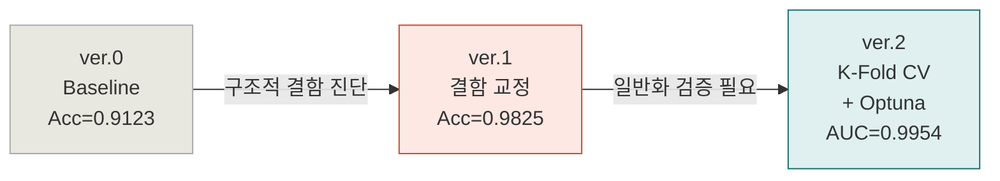

# PyTorch 이진분류 포트폴리오: 유방암 진단
## Breast Cancer Diagnosis · Binary Classification · ver.0 → ver.1 → ver.2


> sklearn의 Breast Cancer Wisconsin 데이터셋(n=569)을 대상으로
> PyTorch MLP 이진분류 모델을 구축하고, **3개 버전**에 걸쳐
> 구조적 결함 교정 · 정규화 · 일반화 검증 · 하이퍼파라미터 자동 탐색을
> 단계적으로 적용한 실험 기록.
> 단순 성능 개선보다 **각 결함의 진단 근거와 개선 방향의 논리적 흐름**에 초점을 맞춘다.

---

## 목차

- [데이터셋 개요](#-데이터셋-개요)
- [실험 파이프라인](#-실험-파이프라인)
- [ver.0 — 기초 실습 Baseline](#ver0--기초-실습-baseline)
- [ver.1 — 구조적 결함 교정](#ver1--구조적-결함-교정)
- [ver.2 — 일반화 검증 + 하이퍼파라미터 자동 탐색](#ver2--일반화-검증--하이퍼파라미터-자동-탐색)
- [전체 성능 비교](#-전체-성능-비교)
- [최종 결론](#-최종-결론)
- [핵심 학습](#-핵심-학습)
- [재현 방법](#-재현-방법)

---

## 데이터셋 개요

| 항목 | 내용 |
|------|------|
| 출처 | `sklearn.datasets.load_breast_cancer` (Wisconsin Diagnostic, 1995) |
| 샘플 수 | n = 569명 |
| 독립변수 | 30개 수치형 (평균·표준오차·최악값 × 10종 형태학적 지표) |
| 종속변수 | 0 = Malignant(악성, 212명) / 1 = Benign(양성, 357명) |
| 클래스 비율 | Malignant : Benign = 37.3% : 62.7% |
| 데이터 분할 | Train 64% / Val 16% / Test 20% (`SEED=42`, `stratify=y`) |

**레이블 인코딩 주의:**
sklearn 기본 설정은 `0=Malignant, 1=Benign`이므로
F1·Recall의 기본값은 Positive(1=Benign) 기준으로 계산된다.
임상적으로 핵심 지표는 **Malignant Recall** = 악성을 놓치지 않는 비율이다.

---

## 실험 파이프라인



---

## ver.0 — 기초 실습 Baseline

### 모델 구조

```
Input(30) → Linear(64) → ReLU → Linear(32) → ReLU
          → Linear(32) → ReLU → Linear(1)  → Sigmoid
```

| 항목 | 설정 |
|------|------|
| 옵티마이저 | Adam (lr=0.001) |
| 손실 함수 | BCELoss |
| 에포크 | 100 (고정) |
| 배치 크기 | 64 |
| 스케일링 | ❌ 미적용 |

### 결과

| 지표 | 값 |
|------|----|
| Accuracy | 0.9123 |
| F1 (Benign) | 0.9286 |
| AUC | 미측정 |
| Malignant Recall | 미측정 |

### 진단된 구조적 결함 4가지

| # | 결함 | 근거 | 영향 |
|---|------|------|------|
| 1 | **StandardScaler 미적용** | `area`(143~2501) vs `fractal_dimension`(0.05~0.10) 스케일 차이 47,160배 | Adam 기울기가 스케일 큰 피처에 지배됨 |
| 2 | **Sigmoid + BCELoss 조합** | sigmoid 출력이 0/1 근방에서 `log(0)` → `-inf` 위험 | 수치 불안정 |
| 3 | **클래스 불균형 미처리** | Malignant 212 vs Benign 357 (1 : 1.68) | Benign(다수 클래스) 예측 편향 |
| 4 | **Linear(32→32) 중복 층** | 동일 차원 변환은 표현력 기여 없이 파라미터만 증가 | 불필요한 복잡도 |
| 5 | **평가 지표 빈약** | Accuracy·F1만 측정 | 의료 데이터에서 Malignant Recall·AUC 누락 |

---

## ver.1 — 구조적 결함 교정

### 적용한 개선 기법

| 기법 | 이유 |
|------|------|
| **StandardScaler** | 피처 스케일 정규화. `fit()`은 Train에만 적용하여 data leakage 차단 |
| **BCEWithLogitsLoss** | Sigmoid 제거 + log-sum-exp trick으로 수치 안정성 확보 |
| **pos_weight = n_neg/n_pos** | Malignant 오분류 패널티 강화로 클래스 불균형 보정 |
| **BatchNorm + Dropout(0.3)** | 수렴 안정화 + 정규화. Linear(32→32) 제거 |
| **Early Stopping (patience=30)** | 최적 에포크 자동 포착. best_state 복원 |
| **평가 지표 강화** | Confusion Matrix · AUC · Malignant Recall · 임계값 최적화 추가 |

### 개선된 아키텍처

```
Input(30) → Linear(64) → BN(64) → ReLU → Dropout(0.3)
          → Linear(32) → BN(32) → ReLU → Dropout(0.3)
          → Linear(1)  [Sigmoid 없음 — BCEWithLogitsLoss 내부 처리]
```

### 학습 곡선 해석

- **Train/Val Loss 간격 좁음** → BatchNorm + Dropout으로 과적합 억제 성공
- **Train Loss 지그재그, Val Loss 매끄러움** → 소규모 데이터(에포크당 배치 ~11개)의 미니배치 노이즈가 에포크 평균에서 충분히 상쇄되지 않는 정상 현상. 성능 문제 아님
- **Early Stop @ Epoch 72** → 불필요한 학습 방지

### 임계값 최적화

```
threshold=0.5 기준  Malignant Recall=0.9762, Accuracy=0.9474
threshold=0.25 기준 Malignant Recall=0.9762, Accuracy=0.9825  ← 최적
```

threshold를 0.5 → 0.25로 낮춰 Benign 분류 기준을 엄격하게 만든 결과,
Malignant Recall을 유지하면서 Accuracy가 0.9474 → 0.9825로 향상되었다.

### 결과 (threshold=0.25 기준)

| 지표 | ver.0 | ver.1 | 변화 |
|------|-------|-------|------|
| Accuracy | 0.9123 | **0.9825** | +0.0702 |
| F1 (Benign) | 0.9286 | **0.9861** | +0.0575 |
| ROC-AUC | 미측정 | **0.9980** | — |
| Malignant Recall | 미측정 | **0.9762** | — |

```
Confusion Matrix (threshold=0.25)
              예측: Malignant  예측: Benign
실제: Malignant      41            1    ← FN 1건
실제: Benign          1           71    ← FP 1건
```

---

## ver.2 — 일반화 검증 + 하이퍼파라미터 자동 탐색

### ver.1 한계 → ver.2 개선 방향

| 한계 | 해결 |
|------|------|
| 단일 분할(SEED=42) 의존 → 분할 방식에 따라 지표 변동 가능 | **5-Fold Stratified CV**로 평균±표준편차 측정 |
| `dropout_p`, `lr`, `weight_decay` 수동 설정 | **Optuna 50 trials** 자동 탐색 |

### 실험 A — 5-Fold Stratified CV (ver.1 아키텍처 기준)

```
Fold 1/5 | Acc=0.9670  F1=0.9735  AUC=0.9886  MalRecall=0.9706
Fold 2/5 | Acc=0.9890  F1=0.9912  AUC=0.9979  MalRecall=1.0000
Fold 3/5 | Acc=0.9560  F1=0.9649  AUC=0.9959  MalRecall=0.9412
Fold 4/5 | Acc=0.9670  F1=0.9739  AUC=0.9979  MalRecall=0.9412
Fold 5/5 | Acc=1.0000  F1=1.0000  AUC=1.0000  MalRecall=1.0000
────────────────────────────────────────────────────────────
평균  Accuracy        : 0.9758 ± 0.0162
평균  AUC             : 0.9961 ± 0.0039   ← 매우 안정적
평균  Malignant Recall: 0.9706 ± 0.0263
```

### 실험 B — Optuna 하이퍼파라미터 탐색

**목적함수: Val AUC 최대화** (임계값 무관, 클래스 불균형에 강건)

**탐색 공간:**

| 파라미터 | 범위 | 탐색 방식 |
|---------|------|----------|
| `hidden1` | 32, 64, 128, 256 | categorical |
| `hidden2` | 16, 32, 64 | categorical |
| `dropout_p` | 0.1 ~ 0.5 | uniform |
| `lr` | 1e-4 ~ 1e-2 | **log scale** |
| `weight_decay` | 1e-5 ~ 1e-2 | **log scale** |
| `batch_size` | 16, 32, 64 | categorical |

**단일 Val vs K-Fold CV 탐색 비교:**

| 탐색 방식 | Best AUC | Best hidden1 | 신뢰도 |
|----------|---------|-------------|--------|
| 단일 Val | 0.9990 | 32 | 낮음 (분산 포함) |
| 3-Fold CV | 0.9978 | **64** | 높음 (분산 제거) |

두 탐색이 서로 다른 파라미터를 선택했다.
단일 Val 탐색이 특정 분할에 편향될 수 있음을 실험적으로 확인했다.

### 최종 결과 (threshold=0.4 기준)

| 지표 | 5-Fold CV | Test |
|------|-----------|------|
| Accuracy | 0.9758 ± 0.0162 | **0.9825** |
| AUC | 0.9961 ± 0.0039 | **0.9954** |
| Malignant Recall | 0.9706 ± 0.0263 | **0.9762** |

```
Confusion Matrix (threshold=0.4)
              예측: Malignant  예측: Benign
실제: Malignant      41            1    ← FN 1건
실제: Benign          1           71    ← FP 1건

Malignant Recall = 41/42 = 0.9762  (목표 ≥ 0.95 달성)
Benign Recall    = 71/72 = 0.9861
```

---

## 📈 전체 성능 비교

| 버전 | Accuracy | AUC | Malignant Recall | 핵심 개선 |
|------|----------|-----|-----------------|----------|
| ver.0 | 0.9123 | 미측정 | 미측정 | Baseline |
| ver.1 | **0.9825** | **0.9980** | **0.9762** | 구조적 결함 교정 + 임계값 최적화 |
| ver.2 | 0.9825 | 0.9954 | 0.9762 | 일반화 신뢰성 검증 완료 |

> **ver.1과 ver.2의 Test 성능이 유사한 이유:**
> ver.2의 핵심 기여는 성능 수치 자체가 아니라
> **K-Fold CV(AUC std=0.0039)로 ver.1 성능의 일반화 신뢰성을 검증**한 것이다.
> CV AUC(0.9961) ≈ Test AUC(0.9954)로 과적합 없음을 확인했다.

---

## 최종 결론

ver.0 → ver.2에 걸쳐 확인된 주요 사실:

1. **구조적 결함 교정이 성능 도약의 핵심이었다.**
   StandardScaler 미적용, Sigmoid+BCELoss 조합, 클래스 불균형 미처리라는
   세 가지 결함을 교정한 것만으로 Accuracy 0.9123 → 0.9825로 향상되었다.

2. **임계값 조정은 모델 재학습 없이 성능을 개선하는 실용적 수단이다.**
   threshold 0.5 → 0.25(ver.1) / 0.4(ver.2) 조정으로
   Malignant Recall을 유지하면서 Accuracy가 유의미하게 향상되었다.

3. **AUC std=0.0039로 모델 안정성을 검증했다.**
   분할 방식에 거의 영향을 받지 않으며, CV와 단일 Test 지표가 일치하여
   과적합 없는 일반화 성능을 확인했다.

4. **단일 Val 탐색의 편향을 실험적으로 확인했다.**
   Optuna 단일 Val(hidden1=32)과 CV 기반(hidden1=64) 탐색이
   서로 다른 파라미터를 선택했다.

---

## key insights

### 1. 정규화 기법 적용 전 과소적합/과적합을 먼저 진단해야 한다
학습 곡선 확인 없이 정규화를 무조건 추가하면 오히려 성능이 악화된다.

### 2. 의료 데이터에서 Accuracy는 충분하지 않다
FN(악성→양성 오진)의 비용이 FP보다 훨씬 크므로
**Malignant Recall과 AUC를 주 지표**로 삼아야 한다.

### 3. BCEWithLogitsLoss가 Sigmoid + BCELoss보다 안정적이다
Sigmoid 출력값이 0/1에 가까울 때 발생하는 수치 불안정 문제를
log-sum-exp trick으로 내부에서 처리한다.

### 4. 단일 분할 성능은 신뢰할 수 없다
n=569 소규모 데이터에서 분할 방식에 따라 AUC가 0.05 이상 변동 가능.
K-Fold CV 평균±표준편차가 신뢰 가능한 주 지표다.

### 5. 학습률은 로그 스케일로 탐색해야 한다
`[0.001, 0.002, 0.003]` 선형 탐색은 특정 자릿수에만 집중된다.
`trial.suggest_float("lr", 1e-4, 1e-2, log=True)`로 로그 스케일 탐색이 필요하다.

---

## 재현 방법

```bash
# 의존성 설치
pip install torch scikit-learn optuna numpy matplotlib

# 노트북 실행 순서
# 1. breast_cancer_ver0.ipynb       — 기초 실습 Baseline
# 2. breast_cancer_improved_ver1.ipynb — 구조적 결함 교정
# 3. breast_cancer_ver2.ipynb          — K-Fold CV + Optuna
```

**공통 재현성 설정 (모든 버전 적용):**

```python
import random, numpy as np, torch

def set_seed(seed: int = 42):
    random.seed(seed)
    np.random.seed(seed)
    torch.manual_seed(seed)
    if torch.cuda.is_available():
        torch.cuda.manual_seed_all(seed)
        torch.backends.cudnn.deterministic = True
        torch.backends.cudnn.benchmark = False

SEED = 42
set_seed(SEED)
device = torch.device("cuda" if torch.cuda.is_available() else "cpu")
```

**데이터 분할 (모든 버전 동일):**

```python
from sklearn.model_selection import train_test_split

x_tv, x_test, y_tv, y_test = train_test_split(
    x, y, test_size=0.2, random_state=42, stratify=y
)
x_train, x_val, y_train, y_val = train_test_split(
    x_tv, y_tv, test_size=0.2, random_state=42, stratify=y_tv
)
# Train: 364 / Val: 91 / Test: 114
```

---

*PyTorch Binary Classification Portfolio · Breast Cancer Wisconsin Dataset · SEED=42 · CUDA T4 · ver.0 – ver.2*
