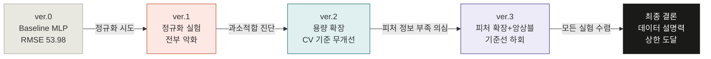

# PyTorch 회귀분석 실험 포트폴리오
## 당뇨병 진행도 예측 · 모델 개선 전 과정


> sklearn의 Diabetes 데이터셋(n=442)을 대상으로 PyTorch MLP 회귀 모델을 구축하고,
> **4개 버전**에 걸쳐 정규화 · 용량 확장 · 피처 엔지니어링 · 앙상블 기법을 체계적으로 실험한 기록.
> 각 버전의 실패 원인을 데이터 기반으로 진단하고 다음 실험 방향을 도출하는 과정에 초점을 맞춘다.

---

## 목차

- [데이터셋 개요](#-데이터셋-개요)
- [실험 파이프라인](#-실험-파이프라인)
- [ver.0 — Baseline MLP](#ver0--baseline-mlp)
- [ver.1 — 정규화·수렴 최적화](#ver1--정규화수렴-최적화)
- [ver.2 — 과소적합 교정](#ver2--과소적합-교정)
- [ver.3 — 피처 엔지니어링 + 앙상블](#ver3--피처-엔지니어링--앙상블)
- [전체 성능 비교](#-전체-성능-비교)
- [최종 결론](#-최종-결론)
- [핵심 학습](#-핵심-학습)
- [재현 방법](#-재현-방법)

---

## 📊 데이터셋 개요

| 항목 | 내용 |
|------|------|
| 출처 | `sklearn.datasets.load_diabetes` (Efron et al., 2004) |
| 샘플 수 | n = 442명 |
| 독립변수 | 10개: `age`, `sex`, `bmi`, `bp`, `s1`~`s6` (mean-centered, scaled 완료) |
| 종속변수 | 기저치 1년 후 질병 진행도 (연속형, 범위 25~346) |
| 문제 유형 | 지도학습 — 회귀 (Supervised Regression) |
| 데이터 분할 | Train 64% / Val 16% / Test 20% (`SEED=42`, 고정) |

---

## 🔄 실험 파이프라인



---

## ver.0 — Baseline MLP

### 목적
PyTorch 회귀 파이프라인 전체를 구현하고 기준 성능을 측정한다.

### 아키텍처 및 학습 설정

```
Input(10) → Linear(64) → ReLU → Linear(32) → ReLU → Linear(1)
```

| 항목 | 값 |
|------|-----|
| 파라미터 수 | 2,561개 |
| 옵티마이저 | Adam (lr=0.001) |
| 손실 함수 | MSELoss |
| 배치 크기 | 64 |
| 에포크 | 500 |
| 디바이스 | CUDA (T4) |

### 구현 특이사항

- **재현성:** `random`, `numpy`, `torch`, `cuda` 4종 시드 고정 (`set_seed(42)`)
- **표준 학습 루프:** `model.train()` / `model.eval()` 분기, `optimizer.zero_grad()` 매 배치 호출
- **GPU→CPU 변환:** `.detach().cpu().flatten().numpy()` 체인으로 텐서를 sklearn 평가 함수에 전달

### 결과

| 지표 | 값 | 해석 |
|------|----|------|
| MSE | 2913.70 | — |
| **RMSE** | **53.98** | 예측 오차 평균 (타겟 std=72.79, RMSE/std=0.74) |
| **R²** | **0.4501** | 분산의 45%만 설명 — 설명력 부족 |

### 관측된 한계 → ver.1 개선 방향

- Val Loss 최솟값 에포크 = 500 → 500 에포크 내 수렴 미완
- 단일 분할 평가만 수행하여 일반화 성능 불명확
- 과적합 여부 미검증 → Dropout·BatchNorm·Early Stopping 도입 계획

---

## ver.1 — 정규화·수렴 최적화

### 목적
과적합을 의심하여 정규화 기법 3종(Dropout, BatchNorm, Early Stopping)을 독립 검증 후 결합한다.

<details>
<summary><b>실험 설계 상세 보기</b></summary>

| 기법 | 메커니즘 | 설정값 |
|------|----------|--------|
| Dropout | 학습 시 무작위 뉴런 비활성화 | p=0.3 |
| Weight Decay (L2) | 손실에 λΣw² 추가 | 1e-4 |
| BatchNorm | 층별 입력 분포 정규화 | `BatchNorm1d` |
| ReduceLROnPlateau | Val Loss 정체 시 lr 감소 | patience=20, factor=0.5 |
| Early Stopping | Val Loss 무개선 시 학습 중단 | patience=50 |

</details>

### 결과

| 실험 | RMSE | R² | Δ RMSE | 비고 |
|------|------|----|---------|------|
| Baseline (기준) | 53.98 | 0.4501 | — | — |
| Dropout(p=0.3) + WD(1e-4) | 54.24 | 0.4447 | +0.26 | 정규화 역효과 |
| BatchNorm + ReduceLROnPlateau | **65.94** | 0.1793 | **+11.96** | LR 과도 억제 |
| Early Stopping (patience=50) | 53.98 | 0.4501 | 0.00 | 500에폭 미발동 |
| 결합 (BN+Drop+WD+Sched+ES) | 54.25 | 0.4445 | +0.27 | 복합 역효과 |

### 실패 원인 분석

**`BatchNorm + Scheduler` 대폭 악화의 원인:**

```
ReduceLROnPlateau(patience=20) 설정
  → 에포크당 배치 ≈ 5개뿐인 환경에서 20에폭마다 lr × 0.5
  → lr: 0.001 → 0.0005 → 0.00025 → ... → 1e-6
  → 사실상 학습 정지
```

**결론 — 과소적합 진단:**

> 정규화 기법 적용 후 성능이 **악화**되는 것은 **과소적합(Underfitting)** 의 충분조건이다.
> 과소적합 모델에 정규화를 추가하면 학습을 더 억제하므로 반드시 성능이 하락한다.
> Early Stopping 미발동 = epoch 500까지 Val Loss 개선 중 → 모델이 수렴 미완 상태.

### ver.2 개선 방향

- 과소적합 교정이 목표이므로 정규화 제거
- 선형 모델(Ridge/Lasso)로 기준선 재설정
- 모델 용량 확장 (Wider / Deeper)
- 에포크 500 → 1500
- K-Fold CV로 단일 분할 편향 제거

---

## ver.2 — 과소적합 교정

### 목적
과소적합으로 진단된 상태에서 ① 선형 기저 모델 비교 ② 모델 용량 확장 ③ K-Fold CV 도입으로 신뢰 가능한 성능을 측정한다.

### 실험 A — 선형 모델 기준점 (단일 분할)

| 모델 | RMSE | R² | Δ vs Baseline |
|------|------|----|----------------|
| Ridge(α=0.1) | 53.52 | 0.4593 | -0.46 |
| **Lasso(α=0.1)** | **52.94** | **0.4710** | **-1.04** |
| Lasso(α=1.0) | 58.26 | 0.3594 | +4.28 |

> Lasso(α=0.1)가 단일 분할 기준 MLP를 약 1 RMSE 개선.

### 실험 B — MLP 용량 확장 (단일 분할)

| 아키텍처 | 파라미터 수 | RMSE | R² |
|---------|------------|------|----|
| Baseline (10→64→32→1) | 2,561 | 53.98 | 0.4501 |
| MLP-Wider (10→128→64→1) | 9,729 | 52.81 | 0.4735 |
| **MLP-Deeper (10→128→64→32→1)** | **11,777** | **51.86** | **0.4923** |

- MLP-Deeper: Early Stop 발동 — Epoch 752 (Best: 652) ← 용량 확장 후 수렴 개선 확인

### 실험 C — 5-Fold CV (신뢰 가능한 주 지표)

```
MLP-Wider (128→64) 5-Fold CV 결과:

  Fold 1 | RMSE=53.71  R²=0.4634
  Fold 2 | RMSE=56.37  R²=0.5431
  Fold 3 | RMSE=53.17  R²=0.4083
  Fold 4 | RMSE=54.23  R²=0.4955
  Fold 5 | RMSE=58.86  R²=0.5007
  ──────────────────────────────
  평균 RMSE = 55.27 ± 2.10
  평균 R²   = 0.4822 ± 0.0448
```

> **단일 분할(52.81) vs CV(55.27):** 격차 2.5 → 단일 분할이 낙관 편향됨을 확인.
> CV 기준으로 Baseline과의 차이는 오차 범위 내 → 의미 있는 개선 없음.

### 핵심 발견 → ver.3 개선 방향

- 선형 모델과 MLP의 단일 분할 격차 < 1.1 RMSE → 비선형 패턴이 제한적
- 피처 수(10개)가 타겟 설명력의 병목일 가능성 → 교호항·다항 피처 추가 검토
- 트리 기반 앙상블(XGBoost, RandomForest)으로 비선형 포착 시도

---

## ver.3 — 피처 엔지니어링 + 앙상블

### 목적
현재 R² 상한(~0.50)이 피처 집합의 한계인지 검증한다.

**가설:** `PolynomialFeatures(degree=2)`로 교호항을 추가하거나
트리 기반 앙상블을 도입하면 R² 0.50을 넘어설 수 있다.

### 실험 A — 다항·교호 피처 확장

피처 확장 규모: **10개 → 65개** (1차 10 + 자기제곱 10 + 교호항 45)

```python
Pipeline([
    ("poly",   PolynomialFeatures(degree=2, include_bias=False)),
    ("scaler", StandardScaler()),   # 2차 항 스케일 보정
    ("model",  Ridge(alpha=...)),   # data leakage 방지
])
```

| 모델 | Test RMSE | CV RMSE | CV R² |
|------|-----------|---------|-------|
| Poly(d=2) + Ridge(α=0.1) | 57.99 | 62.03±4.49 | 0.3500 |
| Poly(d=2) + Ridge(α=10.0) | 53.34 | 58.60±2.70 | 0.4173 |
| **Poly(d=2) + Lasso(α=1.0)** | **51.50** | **57.13±1.60** | **0.4454** |
| Poly(d=2) + MLP(65→128→64→32) | 66.12 | 62.16±3.01 | 0.3427 |

### 실험 B — 트리 기반 앙상블

| 모델 | Test RMSE | CV RMSE | CV R² |
|------|-----------|---------|-------|
| RandomForest(n=200, default) | 55.49 | 58.90±1.92 | 0.4099 |
| XGBoost(n=500, lr=0.05, depth=4) | 57.92 | 61.78±4.10 | 0.3536 |
| RF (GridSearch 최적) | 54.30 | 58.43±1.86 | 0.4200 |
| **XGBoost (GridSearch 최적)** | **52.85** | **58.14±3.17** | **0.4294** |

<details>
<summary><b>GridSearch 최적 하이퍼파라미터</b></summary>

```
RandomForest:
  max_depth=5, min_samples_leaf=1, n_estimators=200

XGBoost:
  learning_rate=0.01, max_depth=3, n_estimators=300, subsample=0.8
```

</details>

### 전체 CV 순위표 (주 지표 기준)

| 순위 | 모델 | CV RMSE | Δ vs Baseline |
|------|------|---------|----------------|
| 1 ★ | **MLP Baseline (재측정)** | **55.64±2.10** | 기준 |
| 2 | Poly + Lasso(α=1.0) | 57.13±1.60 | +1.49 |
| 3 | XGBoost (GridSearch) | 58.14±3.17 | +2.50 |
| 4 | RF (GridSearch) | 58.43±1.86 | +2.79 |
| 5 | RF (default) | 58.90±1.92 | +3.26 |
| … | … | … | … |
| 11 | Poly + MLP | 62.16±3.01 | +6.52 |

> **★ CV 기준으로 기준선을 넘어선 모델이 단 하나도 없다.**

### 피처 중요도 분석

RF · XGBoost 공통 상위 피처:

| 피처 | 설명 | 임상적 의미 |
|------|------|------------|
| `bmi` | 체질량지수 | 당뇨병 발병·진행의 가장 강력한 인자 |
| `s5` (ltg) | 혈청 중성지방 로그값 | 지질 대사 이상과 당뇨 합병증의 연관 |
| `bp` | 평균 혈압 | 고혈압은 당뇨와 흔히 동반되는 대사 이상 |

---

## 📈 전체 성능 비교

### CV RMSE 기준 (5-Fold, 신뢰 가능한 주 지표)

```
Baseline MLP    ████████████████████████████████████  55.64 ± 2.10  ← 기준선
Poly+Lasso(1.0) ███████████████████████████████████████  57.13 ± 1.60
XGBoost(GS)     ████████████████████████████████████████  58.14 ± 3.17
RF(GS)          ████████████████████████████████████████  58.43 ± 1.86
Poly+MLP        ██████████████████████████████████████████████  62.16 ± 3.01
```

### 버전별 최고 단일 분할 RMSE 추이

| 버전 | 최고 Test RMSE | 주요 기법 | CV 기준 개선 |
|------|---------------|----------|-------------|
| ver.0 | 53.98 | MLP(64→32) | — |
| ver.1 | 53.98 | 정규화 (무개선) | ❌ |
| ver.2 | 51.86 | MLP-Deeper(128→64→32) | ❌ (CV 기준) |
| ver.3 | 51.50 | Poly+Lasso | ❌ (CV 기준) |

> 단일 분할 수치는 지속 개선되는 것처럼 보이지만,
> **5-Fold CV 기준으로는 어느 버전도 기준선을 넘지 못했다.**

---

## 🔬 최종 결론

### 데이터 설명력 상한 도달

4개 버전에 걸쳐 누적된 증거:

| 시도 | 결과 | 해석 |
|------|------|------|
| 정규화 추가 (ver.1) | 성능 악화 | 과소적합 상태 → 정규화가 역효과 |
| 모델 용량 확장 (ver.2) | CV 기준 무개선 | 파라미터 수가 병목이 아님 |
| 피처 65개로 확장 (ver.3) | CV 기준 악화 | 교호항이 정보보다 노이즈 가중 |
| 트리 앙상블 (ver.3) | CV 기준 악화 | 비선형 패턴이 제한적임 확인 |

모든 모델의 R²가 **0.45~0.50 구간에 밀집** → 현재 피처 10개로 도달 가능한 이론적 상한선.

### 결론

> 현재 직면한 성능 정체는 **'알고리즘 최적화'** 의 문제가 아닌
> **'데이터 수집 설계'** 의 문제이다.
>
> 실질적 R² 개선은 모델 개선이 아닌
> **투약 이력, 식이 정보, 유전 마커 등 새로운 임상 변수의 추가 확보**에 달려 있다.

---

## 💡 핵심 학습

### 1. 정규화 역효과는 과소적합의 진단 도구다
Dropout·WD 추가 후 성능 악화 → 모델이 과소적합 상태. 개선 기법을 적용하기 전에 과적합/과소적합을 먼저 판별해야 한다.

### 2. 단일 분할 RMSE는 신뢰할 수 없다
n=88인 테스트 세트에서 단일 분할 RMSE는 5 이상 차이날 수 있다. n=442 규모에서는 반드시 **K-Fold CV를 주 지표**로 사용해야 한다.

### 3. LR Scheduler는 데이터 규모를 고려해야 한다
`ReduceLROnPlateau(patience=20)`은 에폭당 배치 5개뿐인 환경에서 사실상 조기 학습 정지를 유발했다. patience는 에포크당 배치 수와 함께 설계해야 한다.

### 4. 딥러닝보다 선형 모델이 먼저다
소규모·전처리 완료 데이터에서 Ridge/Lasso는 MLP와 거의 동등한 성능을 보였다. **딥러닝의 우위는 선형 기저 모델과 비교해야만 주장할 수 있다.**

### 5. 성능 정체는 데이터 문제일 수 있다
모든 모델이 R² 0.45~0.50에 수렴한다면, 알고리즘 튜닝이 아니라 **데이터 자체의 설명력 상한**에 도달한 것이다. 이때 필요한 것은 모델이 아닌 새 변수다.

### 6. 피처 엔지니어링도 증거 기반으로
교호항 65개 추가가 오히려 성능을 악화시켰다. 피처 확장은 반드시 **CV로 검증**하고, 노이즈만 추가할 가능성을 염두에 두어야 한다.

---

## ⚙️ 재현 방법

```bash
# 의존성 설치
pip install torch scikit-learn xgboost numpy matplotlib pandas

# 노트북 실행 순서
# 1. pytorch_diabetes_linear_model_ver0.ipynb  — Baseline MLP
# 2. pytorch_diabetes_ver1.ipynb               — 정규화 실험
# 3. pytorch_diabetes_ver2.ipynb               — 과소적합 교정
# 4. pytorch_diabetes_ver3.ipynb               — 피처 엔지니어링 + 앙상블
```

**공통 재현성 설정 (모든 버전 적용):**

```python
import random, numpy as np, torch

def set_seed(seed: int = 42):
    random.seed(seed)
    np.random.seed(seed)
    torch.manual_seed(seed)
    if torch.cuda.is_available():
        torch.cuda.manual_seed_all(seed)
        torch.backends.cudnn.deterministic = True
        torch.backends.cudnn.benchmark = False

SEED = 42
set_seed(SEED)
device = torch.device("cuda" if torch.cuda.is_available() else "cpu")
```

**데이터 분할 (모든 버전 동일):**

```python
from sklearn.model_selection import train_test_split

x_tv, x_test, y_tv, y_test = train_test_split(x, y, test_size=0.2, random_state=42)
x_train, x_val, y_train, y_val = train_test_split(x_tv, y_tv, test_size=0.2, random_state=42)
# Train: 282 / Val: 71 / Test: 89
```

---

*PyTorch Regression Experiment Series · sklearn Diabetes Dataset · SEED=42 · CUDA T4 · ver.0 – ver.3*
